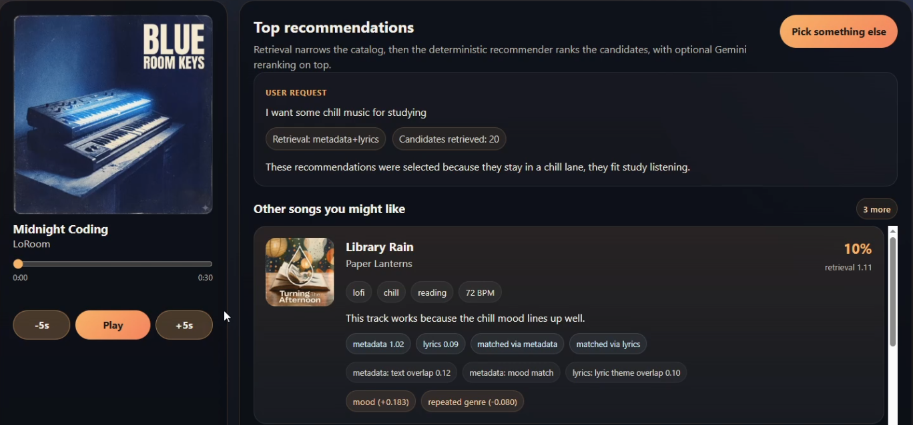
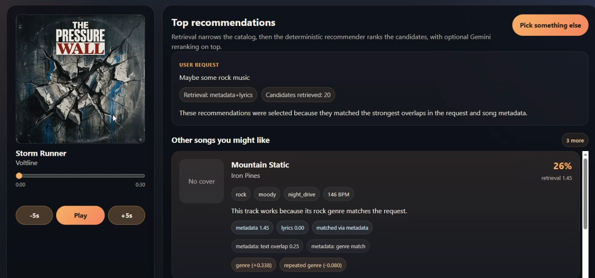
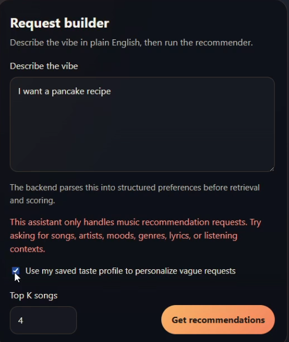

# Vibe Flow

## Project Summary
Vibe Flow is an AI-assisted music recommender built on top of Project 3, Music Recommender.

It combines deterministic recommendation logic with optional Gemini-powered parsing, reranking, and explanations. The goal is to show how a small recommendation system can stay explainable and testable while still using LLM features where they help.

## Architecture Overview


The backend accepts either manual preferences or natural-language requests. It converts those inputs into structured preferences, retrieves candidate songs from local metadata and lyrics, ranks them with a deterministic recommender, and can optionally use Gemini to rerank or explain the results. It also includes an agent-style route that can ask for one clarification when a request is too ambiguous.

## Data Flow
1. The user submits either manual preferences or a natural-language request.
2. The backend turns that input into structured preference fields.
3. The retriever searches the local song catalog using metadata and lyrics.
4. The recommender scores and ranks the candidate songs.
5. Gemini can optionally rerank the top results and generate explanations.
6. In the agent flow, the system can ask for one clarification before finalizing results.

## Data and Testing Notes
- The song names, metadata, mood tags, contexts, and lyrics are synthetic and Gemini-generated for this project.
- Human review is still part of evaluation through manual testing, screenshots, and reflection.
- Automated tests use `pytest` to cover retrieval, ranking, Gemini fallbacks, lyrics endpoints, taste-profile personalization, guardrails, adversarial inputs, and the clarification flow.

## Example Interactions
Note: grammar errors are made on purpose to test the system

"I want sm chill music for studying"


"Maybe some rock music?"


Guardrail example


## Setup
1. Create a virtual environment if you want:

   ```bash
   python -m venv .venv
   source .venv/bin/activate      # Mac or Linux
   .venv\Scripts\activate         # Windows
   ```

2. Install backend dependencies:

   ```bash
   pip install -r requirements.txt
   ```

3. Configure Gemini if you want AI parsing/reranking/explanations:

   ```env
   GEMINI_API_KEY=your_gemini_api_key_here
   GEMINI_MODEL=gemini-2.0-flash
   GEMINI_RERANKING_ENABLED=true
   GEMINI_RERANK_TOP_N=8
   GEMINI_EXPLANATIONS_ENABLED=true
   ```

   If `GEMINI_API_KEY` is missing, the backend falls back to heuristic parsing, deterministic ranking, and heuristic explanations.

4. Run the backend:

   ```bash
   uvicorn backend.main:app --reload
   ```

5. Run the frontend:

   ```bash
   cd frontend
   pnpm install
   pnpm run dev
   ```

6. Open:

   ```bash
   http://127.0.0.1:5173
   ```

## Tests
Run:

```bash
pytest
```

Tests live under `backend/tests/`.

## Design Decisions
I kept the ranking logic deterministic so the core recommendations stay understandable even when Gemini is unavailable. Retrieval over metadata and lyrics makes natural-language requests more useful, while Gemini is limited to parsing, optional reranking, and optional explanations instead of controlling the whole system.

## Limitations and Risks
- The catalog is small at 100 songs, so some requests can produce repeated artists or styles.
- The metadata and lyrics are synthetic, so they reflect project design choices rather than real listening behavior.
- The system works best when the user provides several useful preference signals.
- Gemini features can still fall back to heuristic behavior when the response is missing or invalid.

## Demo


https://github.com/user-attachments/assets/b7608f0a-1643-4cb9-8116-ddeaf3d8a03a


## Reflection
**What are the limitations or biases in your system?**
- The biggest limits are the small catalog, synthetic metadata, and weaker performance on sparse inputs.

**Could your AI be misused, and how would you prevent that?**
- It could be mistaken for a general-purpose assistant or a real commercial recommender. I reduce that risk with a narrow music-only scope, deterministic fallbacks, and an out-of-scope guardrail.

**What surprised you while testing your AI's reliability?**
- The AI-assisted parts could appear to work even when the system had quietly fallen back to heuristic behavior.

**Describe your collaboration with AI during this project. Identify one instance when the AI gave a helpful suggestion and one instance where its suggestion was flawed or incorrect.**
- One helpful suggestion was combining metadata retrieval and lyric retrieval, then using short lyric snippets to ground later Gemini steps. One flawed suggestion was trusting AI-generated behavior too quickly without checking whether the backend had actually fallen back.

[**Model Card**](model_card.md)
